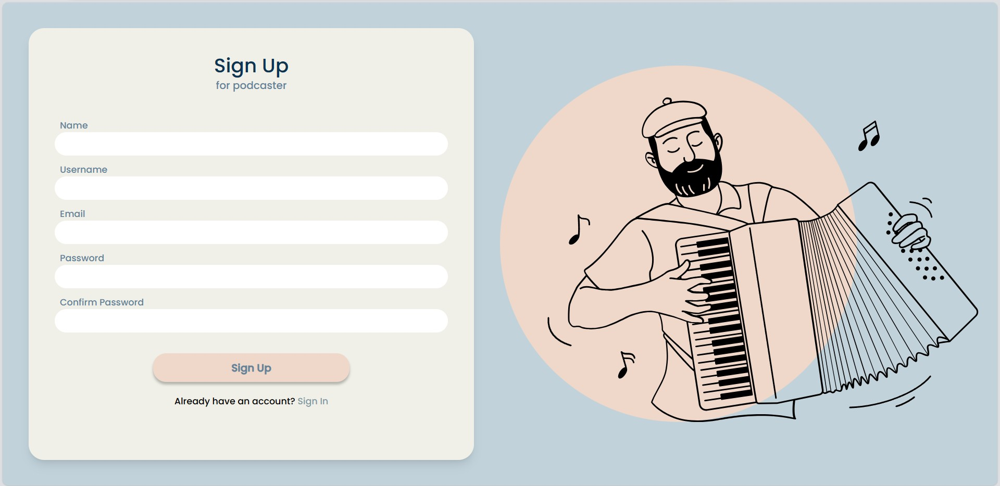
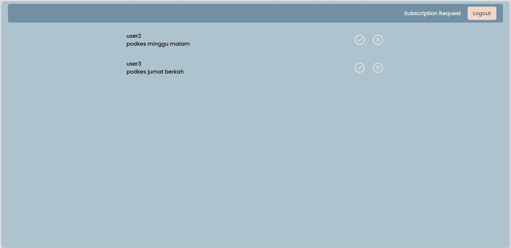
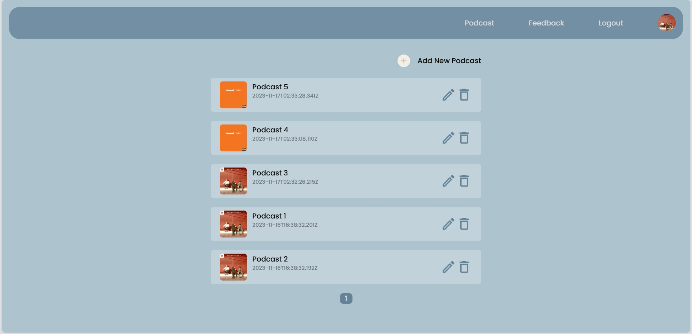
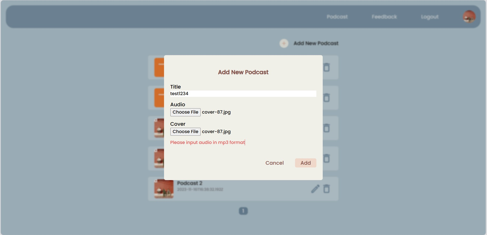
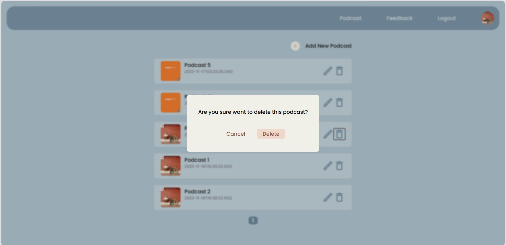
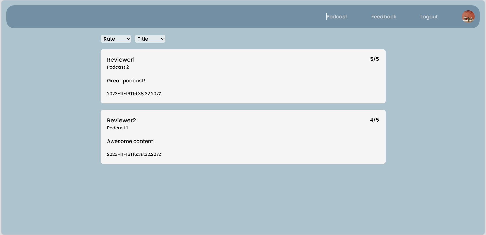
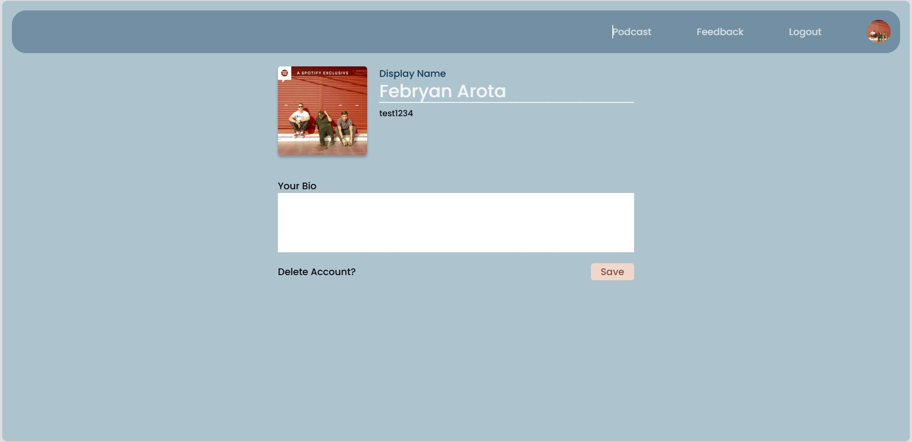
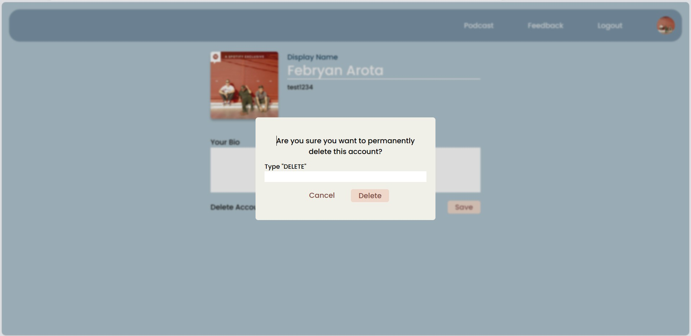

# REST Service
## Tugas Besar 2 IF3110

### Deskripsi singkat
Aplikasi web front-end untuk melakukan manajemen podcast oleh podcaster yang dapat diakses oleh subscribernya. Selain itu, aplikasi ini dapat digunakan untuk melakukan penerimaan atau penolakan oleh admin pada request subscription .

### Install and Run
1. Clone repository
2. `docker-compose up`

### Screenshot Aplikasi
1. Halaman Login

2. Halaman Register

3. Halaman Subscription Request

4. Halaman Manage Podcast

5. Add Podcast

6. Delete Podcast

7. Halaman Feedback

8. Halaman Profile

9. Delete Account

### Pembagian Tugas
- SPA
    - Docker: 13521120
    - Routing and Auth: 13521120
    - Components: 13521120
    - Register, Login: 13521120
    - Feedback: 13521050 
    - Subscription Request: 13521050 
    - Profile: 13521168
    - Manage Podcast: 13521120

### Kelompok 37:
- 13521050 Naufal Syifa Firdaus
- 13521120 Febryan Arota Hia
- 13521168 Satria Octavianus Nababan